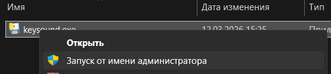

## KeySound — звуки при нажатии клавиш (Windows)

Минимальный проект на Python: глобально слушает нажатия клавиш и проигрывает `.wav` из папки `sounds/`. Работает только под Windows.

### Что умеет

- Проигрывает короткий звук при каждом нажатии клавиши.
- Ведёт **счётчик прожатых клавиш** и показывает его в заголовке иконки в трее + добавлена статистика.
- При выходе через пункт меню **«Закрыть программу»**:
  - показывает уведомление с итоговым количеством нажатий,
  - счётчик обнуляется (при следующем запуске начинается с нуля).

### Стек

- **Python** 3.13+
- **keyboard** — глобальный хук клавиатуры.
- **pygame** (модуль `mixer`) — воспроизведение звуков.
- **pystray** — иконка и меню в системном трее.
- **Pillow** (`PIL`) — отрисовка иконки.
- **pyinstaller** — сборка в `exe`.
- **uv** — управление зависимостями.

### Требования

- **ОС**: Windows 11 (я только на этой системе проверял).
- **Python**: 3.13+.
- Установленный `uv`.

### Для работы с исходниками установите зависимости и активируйте виртуальное окружение

```bash
uv sync && .venv\Scripts\activate
```

### Папка со звуками

- Все `.wav`‑файлы лежат в папке `sounds/` рядом с исходниками / exe.
- Сопоставление **клавиша → звук** задаётся в файле `keysound_sounds.py` в словаре `KEY_TO_SOUND`.
- Значение в `KEY_TO_SOUND` — это базовое имя файла без расширения, например:
  - `"q": "8i"` → будет играться файл `sounds/8i.wav`,
  - `"enter": "downentershiftlshiftrupwin"` → будет играться `sounds/downentershiftlshiftrupwin.wav`.
- Если клавиши нет в `KEY_TO_SOUND`, по умолчанию ищется `<имя_клавиши>.wav` (например, `a.wav`, `j.wav` и т.п.).
- Если подходящий файл не найден, используется **запасной** звук `-[9o.wav`.

### Сборка в exe

В PowerShell из корня проекта:

```powershell
.\build.ps1
```

Готовый exe будет в `dist/keysound.exe` (его размер будет 21,6 МБ (22 746 828 байт))

Чтобы звуки воспроизводились везде (в терминале в частности), необходимо запускать программу от имени администратора 
 

